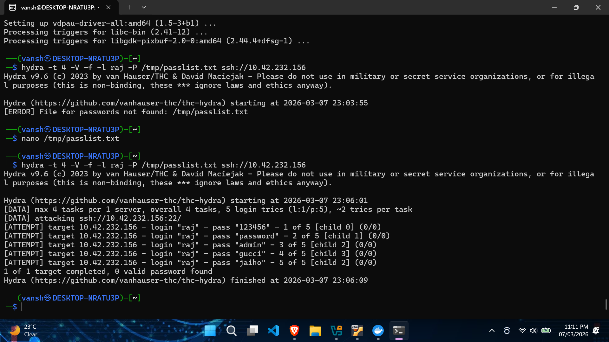
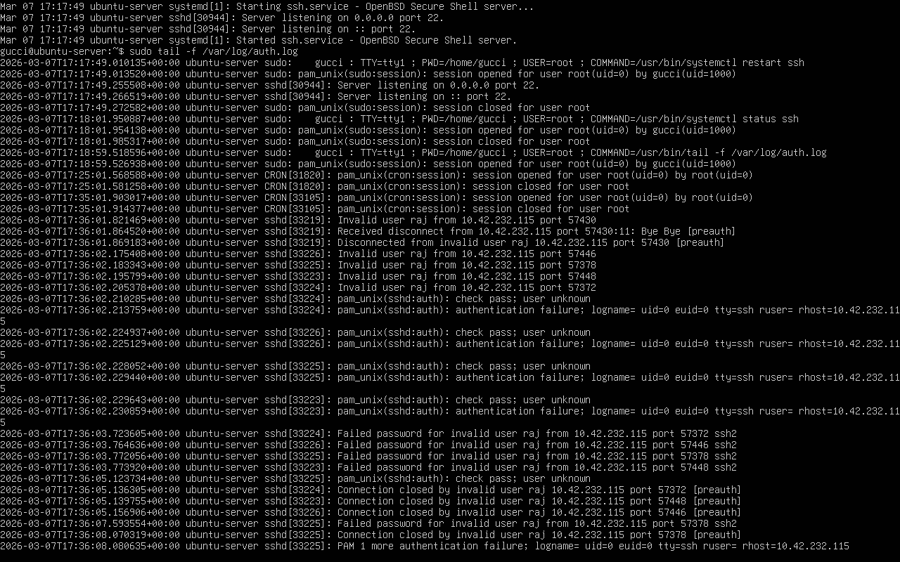
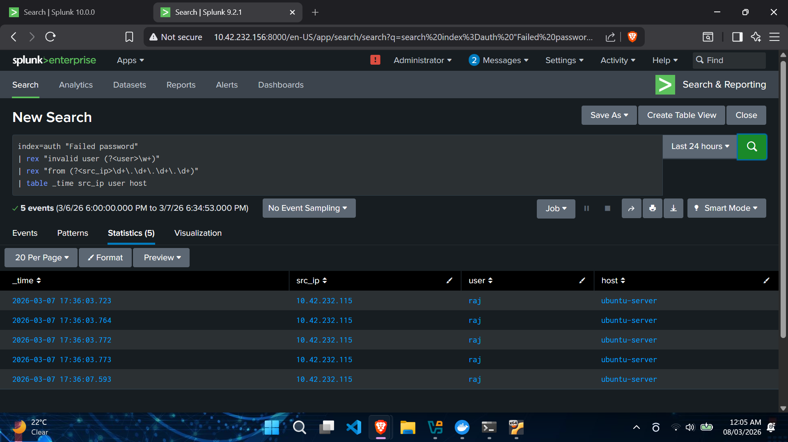

# SSH Brute Force Detection using Splunk

## Overview

This project demonstrates how to simulate and detect SSH brute-force attacks using **Hydra** and **Splunk SIEM** by analyzing Linux authentication logs.
The goal is to generate SSH login failures, ingest logs into Splunk, detect suspicious activity using SPL queries, and identify the attacker IP address.

---

## Tools Used

* **Kali Linux** – Attacker Machine
* **Ubuntu Server** – Victim Machine
* **Hydra** – Brute-force password attack tool
* **Splunk Enterprise** – Security Information and Event Management (SIEM)

---

## Lab Environment

| Component        | Description                    |
| ---------------- | ------------------------------ |
| Attacker Machine | Kali Linux running Hydra       |
| Victim Machine   | Ubuntu Server with SSH enabled |
| SIEM             | Splunk Enterprise              |
| Logs             | `/var/log/auth.log`            |

---

## Lab Setup

### 1. Check SSH Status

```bash
sudo systemctl status ssh
```

### 2. Enable Password Authentication

Open SSH configuration:

```bash
sudo nano /etc/ssh/sshd_config
```

Set:

```
PasswordAuthentication yes
```

Restart SSH service:

```bash
sudo systemctl restart ssh
```

### 3. Monitor Authentication Logs

```bash
sudo tail -f /var/log/auth.log
```

This log file records all authentication attempts including SSH login failures.

---

## Attack Simulation

A brute-force attack is simulated from **Kali Linux** using Hydra.

Command used:

```bash
hydra -t 4 -V -f -l raj -P /tmp/passlist.txt ssh://10.42.232.156
```

### Command Explanation

| Parameter           | Description                        |
| ------------------- | ---------------------------------- |
| `-t 4`              | Number of parallel login attempts  |
| `-V`                | Verbose output                     |
| `-f`                | Stop attack once password is found |
| `-l`                | Target username                    |
| `-P`                | Password list file                 |
| `ssh://<TARGET_IP>` | Target SSH server                  |

This command attempts multiple password combinations against the SSH service.

---

## Splunk Detection

Authentication logs are collected in Splunk.

Example SPL query used to detect SSH brute-force attempts:

```
index=auth "Failed password"
| rex "from (?<src_ip>\d+\.\d+\.\d+\.\d+)"
| stats count by src_ip
| sort -count
```

### What This Query Does

* Searches for **failed SSH login attempts**
* Extracts the **attacker IP address**
* Counts the number of attempts per IP
* Displays the most suspicious IPs first

---

## Investigation Query

```
index=auth "Failed password"
| rex "from (?<src_ip>\d+\.\d+\.\d+\.\d+)"
| rex "for (?<user>\w+)"
| table _time src_ip user host
```

This query shows:

* Time of attack
* Attacker IP address
* Target username
* Target host machine

---

## Attack Simulation Screenshot

Hydra brute-force attack performed from Kali Linux.



---

## Victim Machine

Ubuntu server where the SSH attack was performed.



---

## Detection in Splunk

Splunk query detecting multiple failed SSH login attempts.



---

## Response / Mitigation

The attacker IP can be blocked using firewall rules.

Using **UFW**:

```bash
sudo ufw deny from <attacker_ip> to any port 22
```

Using **iptables**:

```bash
sudo iptables -I INPUT -s <attacker_ip> -p tcp --dport 22 -j DROP
```

---

## Key Learning Outcomes

* Understanding SSH brute-force attacks
* Detecting attacks using Splunk SIEM
* Log analysis using Linux authentication logs
* Extracting attacker IP addresses
* Implementing firewall-based mitigation

---

## Author

Vansh Tiwari
Cybersecurity Student | SOC Analyst Learner


